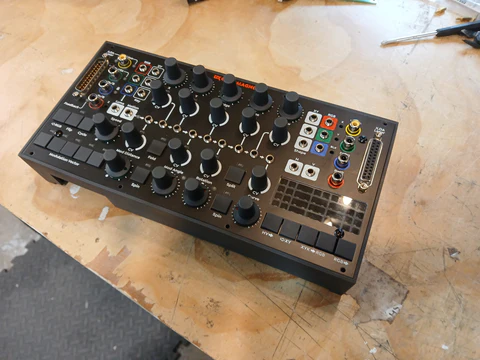
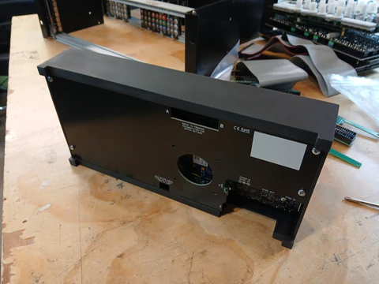
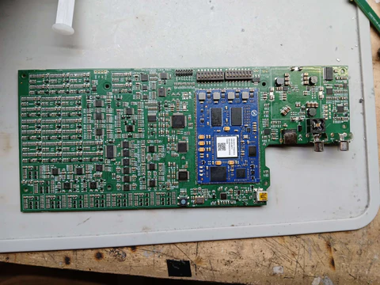
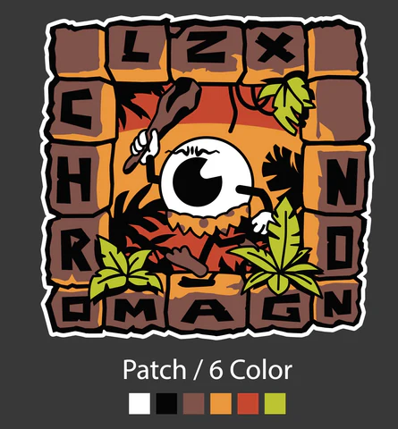

Hello on Tuesday.  I hope everyone in the States had a nice Memorial Day weekend.  Lots to cover in this update, so I will be terse.

Black prototypes of the Chromagnon plastic pieces and enclosure arrived, and the test fits are looking great.   The pieces below aren't final for the enclosure, but should give you the plan on how it all fits together.  Now that all the dimensional constraints are confirmed, I can make any cosmetic tweaks (rounded corners, for example) and order an initial production quantity.

Last week, we finally got the RevG core board built up. This week, I'm running through my checklist of revision items to make sure that everything that was corrected from RevF is now functioning as intended.  

As we move into June, there are three main objectives on my plate:

1) Purchase an initial quantity of plastic parts and backlit film inserts for the LED grid. This will probably be 5-10 sets to start, and then we will ramp up if everything is going smoothly.
2) Finalize the testing platform for the existing Chromagnon control boards, and get an initial quantity of the existing control assemblies through testing.
3) Release V1.0 of the firmware, which still needs a few utility functions such as user firmware update procedure and some hardware self tests.

This will all lead up to our "ship unit one" goal.  Once we hit that, we can transition into Chromagnon documentation, promotion, and ongoing production.

Thanks for being patient with me.  As I have brought up in the last couple posts, our team has downsized significantly since the beginning of the year -- this has pushed a large number of new tasks onto my plate personally, which has meant my time is split across Chromagnon, shipping, purchasing and managing ongoing production.  On one hand this has been intense, but on the other, the company is more stable and I feel like we are in better control of our path moving forward.

Here's a preview of the new Chromagnon patch design.  What do you think?

And now, here are your questions since the last update.

**Jeffrey asked, "Will the Chromagon make the Cyclops obsolete? If not, in what ways will the Cyclops still be relevant?"**

Chromagnon is not a direct replacement for Cyclops. Chromagnon is an integrated color vector and video processor with ILDA input and output.  Cyclops is an ILDA output module for EuroRack synthesizers. One way you could use them together is to use Cyclops to create patterns from your EuroRack synthesizer, and then use Chromagnon as a post-processor for the resulting patterns, between your EuroRack and your laser.

**Paul Rogers asked, "Will LZX be embracing generative AI, and implementing it into to a module?"**

Interesting question.  As a company dedicated to the longevity of analog and embedded hardware technology, any attempt to integrate Stable Diffusion algorithms, or generative models, into our gear would manifest as a program for one of our FPGA platforms like TBC2 or Memory Palace.  In a way, I feel like the tactile nature of analog feedback, and processing in general, is a different kind of generative intelligence and provides a necessary counterpoint to our culture's current obsession with generative algorithms and models.  

In any case, I'm quite content focusing mostly on analog and partially on embedded digital for the foreseeable future. There are still countless ideas in this area that I would like for LZX to explore.  It is likely that we will develop new solutions for interfacing the analog worlds with the software worlds more seamlessly, rather than developing a generative AI product.

**Dream Taser said, "Hi Lars! The Chromagnon updates are brontosaurus burgers for a hungry caveman! Much appreciated! I wanted to suggest something for the artwork… cavemen projecting torchlight on cave wall, perhaps some animated animals and something to do with northern lights 😁"**

Brilliant ideas! I love the idea of cave paintings in torchlight. Beneath Chromagnon's cheeky persona, this idea is part of the instrumentation concept -- a connection to something primal and prehistoric. I hope Chromagnon taps into the firestarter and toolholder instincts in every human operator's brain, and that they feel personally connected to the visual results.  The initial visual metaphor I have had in my head from the beginning is the "primordial pool" -- a swirling, rotating mass of colors and ingredients. 

Got more questions? Ask ‘em here: https://wkf.ms/47lhPPA

Thanks for tuning in,

Lars